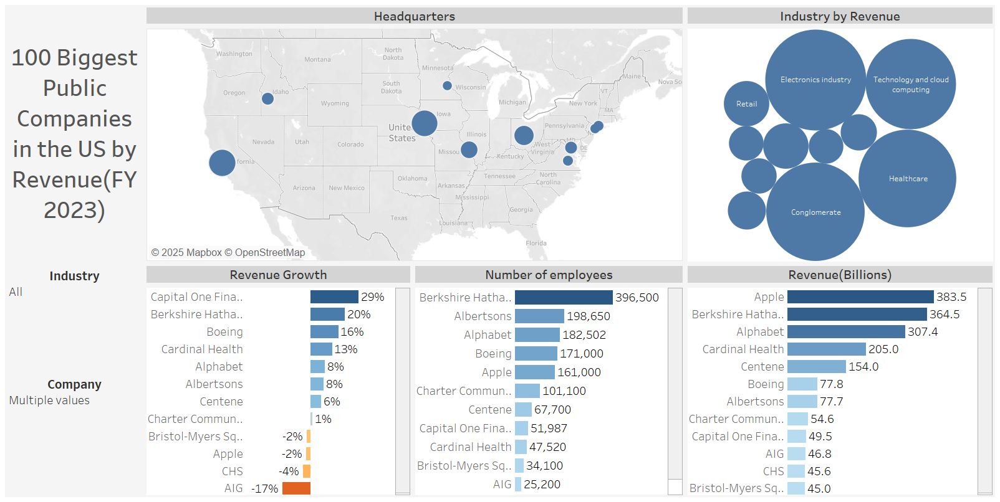

# 🏢 Largest U.S. Companies by Revenue – Web Scraping + Tableau Project

This project is a simple attempt to gather and clean data about the biggest companies in the U.S. based on revenue, and then use that data in Tableau to create visualizations.

---

## 🛠 Tools Used

- **Python**: For web scraping and cleaning the data
- **BeautifulSoup** + **Requests**: To fetch and parse the table from Wikipedia
- **Pandas**: To clean and structure the data
- **Tableau**: To create an interactive dashboard for analysis

---

## 🔍 What This Project Does

- Collects a list of the largest U.S. companies by revenue from Wikipedia
- Cleans the data by removing extra symbols and converting text to numbers
- Splits the company headquarters into city and state for better visuals
- Saves the final clean data as a CSV
- Dashboard built in Tableau using this cleaned data

---

## 📁 Output Columns

- rank
- name
- industry
- revenue (in USD billions)
- revenue growth (%)
- employees
- city
- state

---

## 📸 Tableau Dashboard

You can view the dashboard here:  
 

---

## 📝 Notes

- This project was done by a new grad as part of a data learning portfolio.
- Main focus was to get hands-on practice with real-world data cleaning and simple dashboarding.
